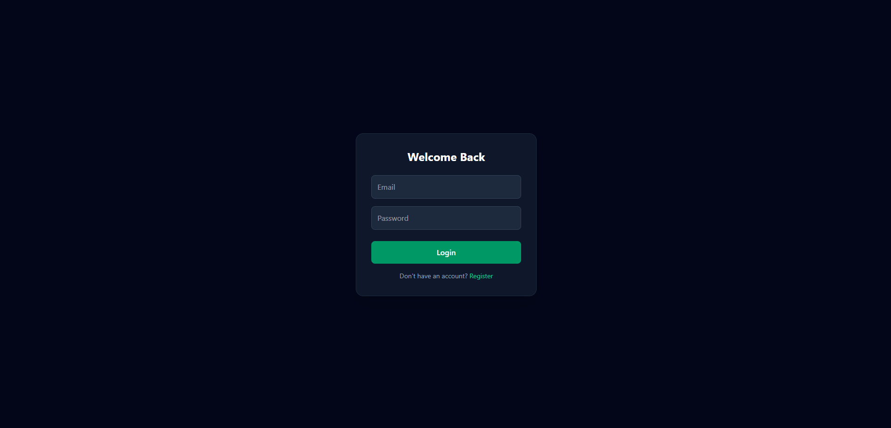
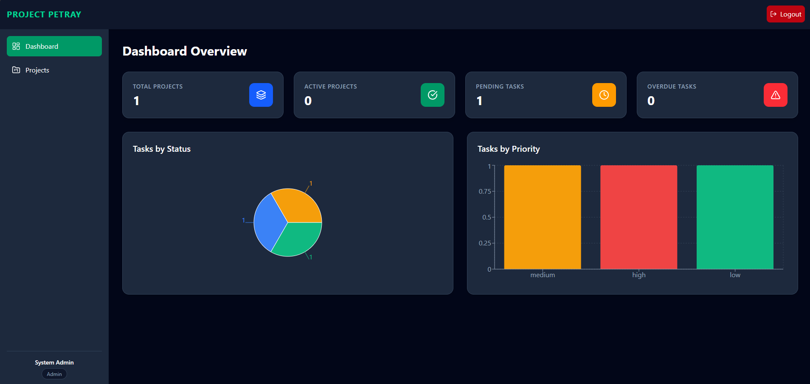
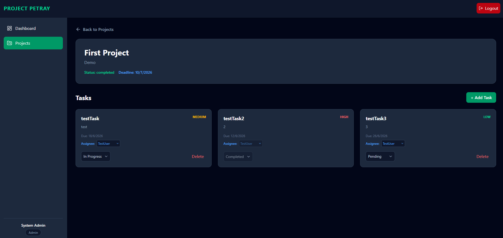

# Project Petray

This platform allows team leaders (Admins) and team members (Members) to collaborate seamlessly on projects, assign tasks, update statuses, and visualize project deadlines through a dynamic dashboard.




---

## ✦ Key Features

### 🏢 Dual Role-Based Access Control (RBAC)
* **Admin Console:** Create projects, add and manage tasks, assign users, oversee the entire workflow, and view global analytics across all platform activities.
* **Member Space:** Access explicitly assigned projects, view tasks, reassign tasks to other members, update task statuses, and view an isolated analytics dashboard showing *only* their personalized workload and assigned projects. (Creation of projects and tasks is restricted strictly to Admins).

### 📱 Full Responsive Adaptation
* Responsive viewport styling designed for mobile, tablet, and desktop screens.
* **Navigation:** Sleek sidebar and top navbar for seamless navigation across Dashboard, Projects, and Task details. Features fast, non-reloading back navigation.

### 📅 Advanced Task, Assignment & Analytics Intelligence
* **Dashboard Analytics:** Visual representation of Tasks by Status and Tasks by Priority using interactive charts (Global for Admins, strictly isolated for Members).
* **Task Assignment:** Real-time assignment/reassignment dropdowns dynamically filtered to only allow selection of registered Member users.
* **Status Updates:** Quickly change task status (Pending, In Progress, Completed).

### 🎨 Visual & Aesthetic Design System
* Harmonious dark color scheme with emerald accents, subtle borders, shadows, and smooth transitions.
* Modern layout for metrics cards highlighting critical data like Overdue Tasks and Active Projects.

---

## 🛠️ Technology Stack

* **Frontend:**
  * Framework: React.js (Vite)
  * Styles: Tailwind CSS
  * Icons: Lucide React
  * Charts: Recharts
  * HTTP Client: Axios
* **Backend:**
  * Environment: Node.js (Express)
  * Database: MongoDB (Mongoose Schema Object ODM)
  * Authentication: JWT Tokens (JSON Web Tokens) with Bcrypt password hashing

---

## 🚀 Setup & Execution Guide

### 📋 Prerequisites
Make sure you have the following installed:
- [Node.js](https://nodejs.org/) (v18 or higher recommended)
- [MongoDB Atlas](https://www.mongodb.com/cloud/atlas) URI string or local MongoDB installation running at `mongodb://127.0.0.1:27017/`

---

### 1. Repository Installation
Navigate to the project directory:
```bash
cd "Project_Petray2"
```

### 2. Configure Environment Variables

Create a `.env` configuration file in both the frontend and backend folders (or refer to `.env.example`).

#### Backend Env (`backend/.env`):
```env
PORT=5000
MONGO_URI=mongodb://127.0.0.1:27017/project-petray
JWT_SECRET=super_secret_jwt_key
```

#### Frontend Env (`frontend/.env`):
```env
VITE_API_URL=http://localhost:5000/api
```

---

### 3. Install Dependencies
Install dependencies for both frontend and backend:

#### Backend:
```bash
cd backend
pnpm install
```

#### Frontend:
```bash
cd frontend
pnpm install
```

---

### 4. Create Initial Admin Credentials (Seeding)
To start using the Admin Console, execute the backend seeding script to create a secure, initial Admin account:
```bash
cd backend
node src/createAdmin.js
```
*This will create an admin with email `admin@petray.com` and password `adminpassword123`.*

---

### 5. Running the Application Locally

#### Start Backend server:
```bash
cd backend
pnpm run dev
```
*Launches at `http://localhost:5000`*

#### Start Frontend dashboard server:
```bash
cd frontend
pnpm run dev
```
*Launches at `http://localhost:5173`*

---

## 🔒 Security
* **Authentication:** Robust JWT-based authentication for protecting sensitive API endpoints.
* **Passwords:** Securely hashed with bcryptjs before saving to MongoDB.
